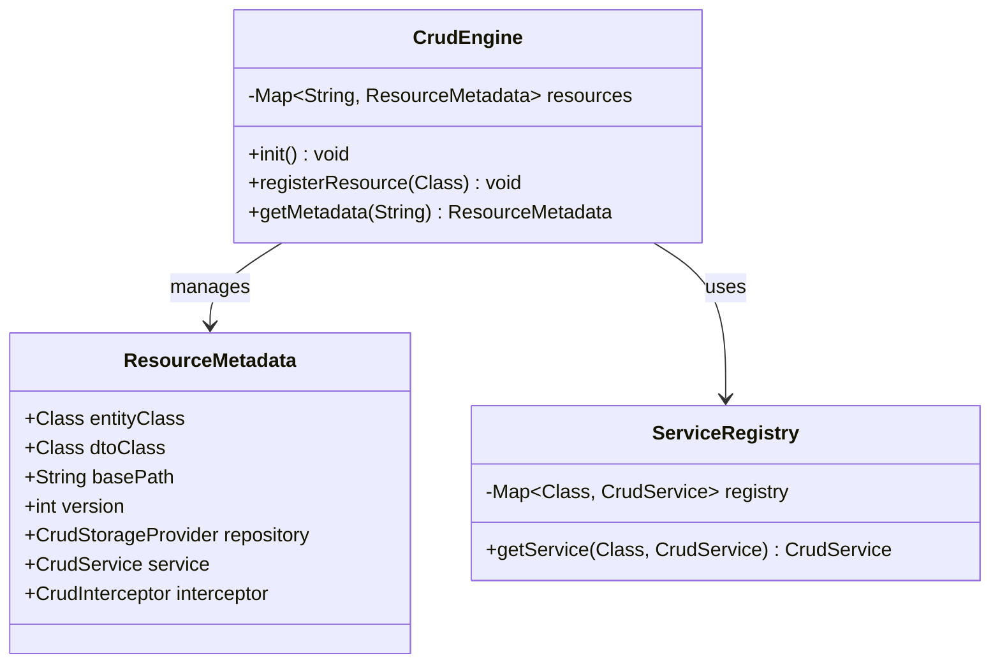
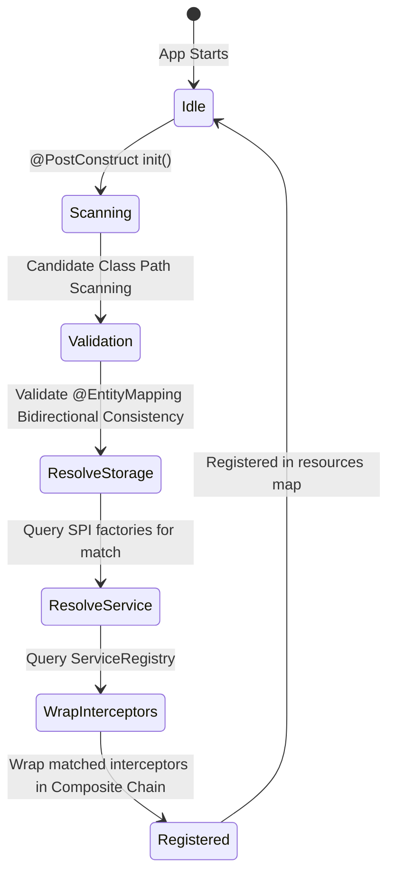

# Core Module Architecture (Mermaid)

This file contains Mermaid diagrams visualizing the structure and design of the core module (`crud-engine-core`).

## 1. Class Structure

## 2. Dynamic Initialization Lifecycle

